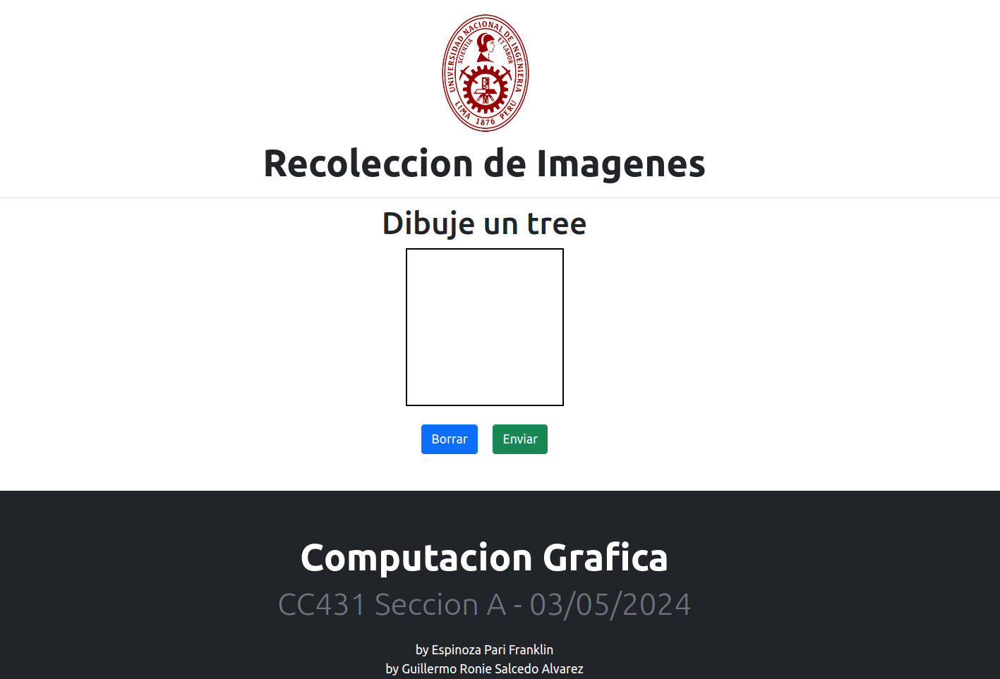
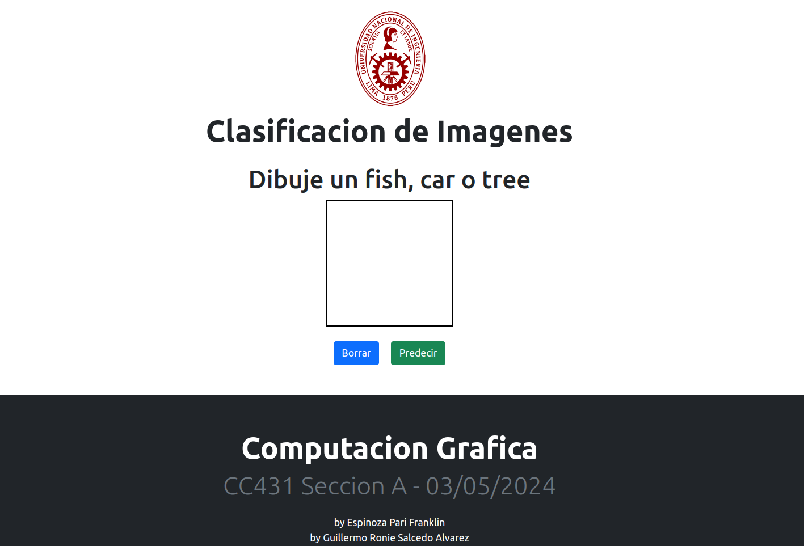
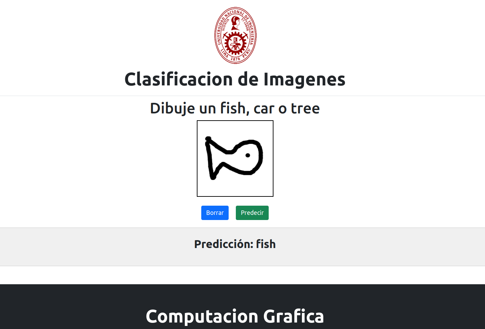

# CC431 - PC2
---

## Integrantes
- Espinoza Pari Franklin
- Salcedo Alvarez Guillermo Ronie

## Sobre el trabajo
Para la realización de nuestro trabajo, nuestro modelo consta de la predicción de tres objetos: un pescado, un carro y un árbol.

Tendremos dos páginas, en la primera, `recollect.py`, tendremos un espacio en el que dibujar una imagen según el enunciado, y en la segunda, `app.py`, será nuestro espacion en el cual dibujaremos la imagen que se indique, y este predecirá la imagen correspondiente. Para ambos casos, ejecutaremos cada uno por medio del comando `python3 [name.py]`.

Página para la recolección de imágenes (`recollect.py`):

Página para la predicción de imágenes (`app.py`):

